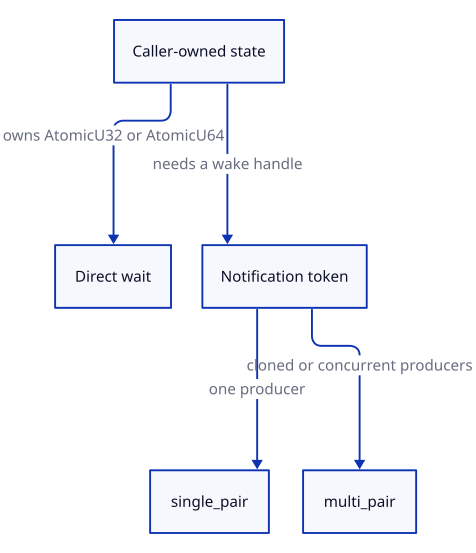

# snoozer

Low-latency waiting primitives for a dedicated consumer thread.

## Change Contract

- **Responsibility:** wait for a caller-owned atomic value or a coalescing notification token.
- **Boundary:** Snoozer does not change affinity, scheduling, power policy, or CPU idle states.
- **Invariant:** raw waits can return without confirming work; filtered waits return only after an
  Acquire load observes the requested state. Hardware waiting requires a successful preflight and
  never silently falls back to another strategy.
- **Configuration:** crate metadata lives in [`Cargo.toml`](Cargo.toml); benchmark settings live
  in [`benches/wake_latency.rs`](benches/wake_latency.rs).
- **Check:** run `just ci`.

## Start here

Choose one of two shapes:

- **Direct wait:** you already have an `AtomicU32` or `AtomicU64` that says whether work is ready.
- **Parker pair:** you want a small notification handle in addition to your work queue.

Diagram contract
Purpose: choose the public waiting shape.
Nodes: caller-owned state, direct wait, Parker pair, producer count.
Relations: state ownership selects the API; producer count selects the Parker constructor.
Invariant: `multi` means multiple producers, never multiple consumers.
Source: [`docs/diagrams/api-choice.d2`](docs/diagrams/api-choice.d2)



### Direct wait

Use a filtered wait when returning early would not help:

```rust
use snoozer::{SpinThenYield, WaitStrategy as _};
use std::sync::atomic::AtomicU64;

let state = AtomicU64::new(1);
let strategy = SpinThenYield::new(32);
assert_eq!(strategy.wait_until_different(&state, 0), 1);
```

Use `wait_if_equal` only when an `Unclassified` result is safe to recheck in your own loop.

### Parker pair

Use `single_pair` for one producer. It is the cheaper option:

```rust
use snoozer::{BusySpin, single_pair};

let (mut parker, mut unparker) = single_pair(BusySpin);
unparker.unpark();
parker.park_until_notified();
```

Use `multi_pair` only when producers must clone or concurrently share the wake handle. Both Parker
types always have one consumer.

### Hardware wait

On supported Linux x86-64 hardware, run preflight once during startup before constructing the
hardware strategy:

```no_run
use snoozer::{HardwareWait, WaitStrategy as _};

HardwareWait::preflight()?;
let strategy = HardwareWait::new()?;
# Ok::<(), snoozer::HardwareWaitError>(())
```

Preflight proves only that bounded probe trials worked in this process. It is not a latency or
power claim.

## Learn more

- [Waiting API](docs/waiting-api.md) — pick raw vs filtered operations and Parker ownership.
- [Architecture](docs/architecture.md) — protocol layers and the lost-wake guard.
- [Safety](docs/safety.md) — memory ordering, lifetime, and hardware boundaries.
- [Benchmarking](docs/benchmarking.md) — controlled latency measurements.
- [Release process](docs/releasing.md) — bootstrap and automated releases with release-plz.
- [Benchctl](docs/benchctl.md) — official benchmark build and host-state lifecycle.
- [Decisions](docs/decisions/README.md) — design rationale.

## Status

This is experimental systems software. Results depend on the processor, firmware, kernel,
topology, and power configuration of a specific run; no strategy is universally fastest.

Licensed under either [Apache-2.0](LICENSE-APACHE) or [MIT](LICENSE-MIT), at your option.
