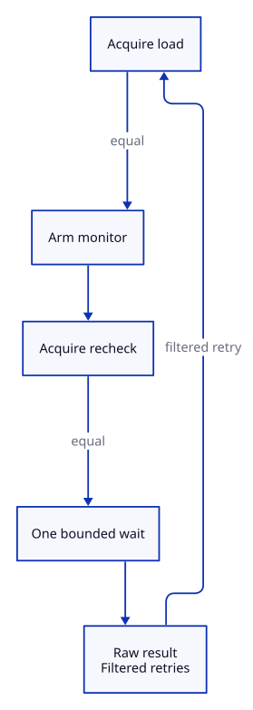
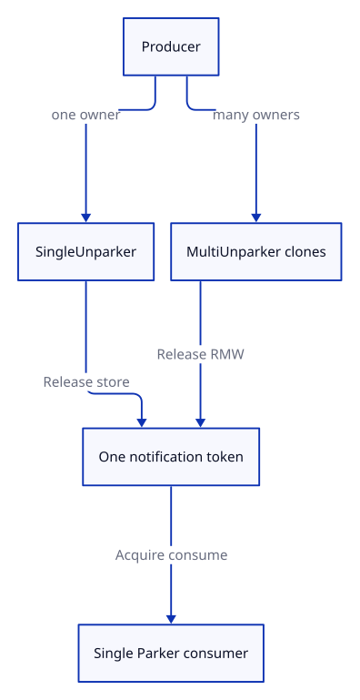

# Waiting API

Use this page to choose an operation. [Architecture](architecture.md) explains how it works;
[Safety](safety.md) owns the detailed memory-ordering rules.

## Raw or filtered?

| Contract | Direct atomic | Parker | What a return proves |
| --- | --- | --- | --- |
| Raw | `wait_if_equal` | `park` | One wait attempt ended. Recheck application state. |
| Filtered | `wait_until_different` | `park_until_notified` | An Acquire load observed the requested state. |

An **unclassified** raw result means “the wait ended, but Snoozer did not observe your condition.”
It is not a notification and does not synchronize with a producer. Use a filtered operation when
that distinction is inconvenient.

Diagram contract
Purpose: show why direct raw waiting cannot lose a store during monitor setup.
Nodes: initial load, monitor arm, second load, bounded wait, raw result with filtered retry.
Relations: each arrow is the next operation; a filtered wait retries after an unclassified result.
Invariant: the second Acquire load happens after the monitor is armed.
Source: [`diagrams/direct-wait.d2`](diagrams/direct-wait.d2)



## Direct waits

Use direct waits when a caller-owned `AtomicU32` or `AtomicU64` already represents readiness:

```rust
use snoozer::{BusySpin, WaitStrategy as _};
use std::sync::atomic::AtomicU32;

let ready = AtomicU32::new(1);
assert_eq!(BusySpin.wait_until_different(&ready, 0), 1);
```

The filtered method observes the value with Acquire ordering. Direct waits observe the current
value, not history: if a value changes and changes back before the waiter reloads it, waiting may
continue. Use a generation counter when every transition matters.

## Parker pairs

Use a Parker pair when work lives in a queue or another structure and a separate notification is
useful:

```rust
use snoozer::{BusySpin, single_pair};

let (mut parker, mut unparker) = single_pair(BusySpin);
unparker.unpark();
parker.park_until_notified();
```

| Constructor | Producers | Consumer | Choose it when |
| --- | --- | --- | --- |
| `single_pair` | One exclusive `SingleUnparker` | One `SingleParker` | Lowest producer overhead matters. |
| `multi_pair` | Clonable `MultiUnparker` handles | One `MultiParker` | Producers must clone or share the handle. |

`multi` means many producers, never many consumers. Both pairs store at most one notification, so
notifications coalesce; neither one is a work queue or counter.

Diagram contract
Purpose: show the ownership and ordering difference between Parker pairs.
Nodes: producer, SingleUnparker, MultiUnparker, token, single Parker consumer.
Relations: producer ownership chooses the publication operation; the consumer Acquire-consumes one token.
Invariant: both paths have exactly one consumer and coalesce notifications.
Source: [`diagrams/parker-token.d2`](diagrams/parker-token.d2)



## Strategies

- `BusySpin` continuously polls: good for very short gaps, expensive for a CPU.
- `SpinThenYield` polls briefly, then gives the scheduler a turn.
- `HardwareWait` uses AMD `MONITORX/MWAITX` or Intel `UMONITOR/UMWAIT` after preflight.
- `SpinThenHardwareWait` combines a spin prefix with that hardware path.

Call `HardwareWait::preflight()` after fixing the process CPU/power policy and before creating a
hardware strategy. A pass shows that bounded probe trials worked; it does not measure latency or
explain why an individual wait ended. Unsupported or failed hardware is a typed error, never an
automatic fallback.

Use `capabilities()` when you only need CPUID facts. It does not run the probe.

## More detail

- [Architecture](architecture.md) — layers, monitor protocol, and backend selection.
- [Safety](safety.md) — atomic ordering, lifetimes, and unsupported-hardware behavior.
- [Benchmarking](benchmarking.md) — compare strategies on the target machine.
